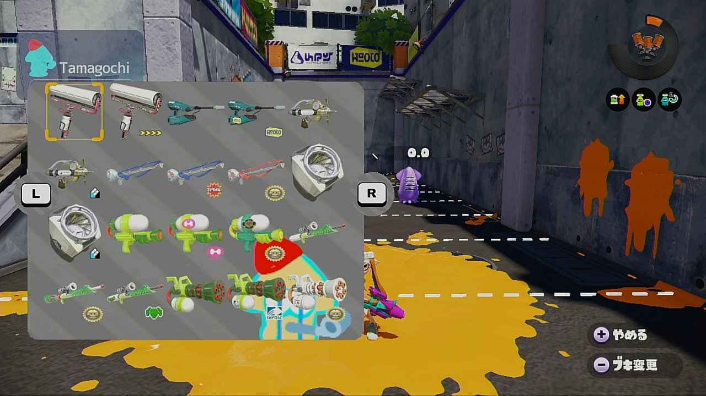

 
  

<h1 align="center"> Tamagochi </h1>
<h3 align="center"> wiiuのゲーム中に任意の画像を表示できる仕組み</h3>

 
  

# 概要

WiiUのメイングラフィックスプロセッサであるGX2の関数を用いて、ゲームのプレイ中にWiiUの画面上に任意の画像を表示する仕組みと、その仕組みを使った例としてスプラトゥーンの武器変更メニューを実装しました。

# ファイルの説明

 - function_patcher_gx2.cpp - 武器変更メニューが実装されている場所
 - function_patcher_gx2.h - function_patcher_gx2.cppのヘッダファイル
 - overlay/video/Overlay.cpp - 画像を表示するための関数がある場所
 - overlay/video/Overlay.h - Overlay.cppのヘッダファイル
 - その他のファイル - libguiから参照した画像表示に必要なファイル

# クレジット

libgui - 画像表示のベースとなる構造
